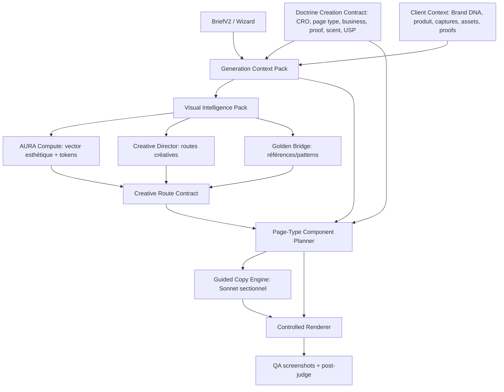

# GSG Reconstruction Spec V27.2 — Strategy + Visual Intelligence + Controlled Execution

> Status: validated direction by Mathis, implementation sprint starts here.
> Date: 2026-05-06
> Scope: canonical GSG only (`skills/gsg` + `moteur_gsg`). No legacy public entrypoint.

## Executive Decision

The canonical GSG is not an Audit-to-LP recycler. It is an autonomous landing page creation system that can read GrowthCRO context, doctrine and client artefacts, but only depends on Audit/Reco in Mode 2 `replace`.

The final target is not a bigger prompt. It is a decision system:

1. `BriefV2 / Wizard`
2. `GenerationContextPack`
3. `DoctrineCreationContract`
4. `VisualIntelligencePack`
5. `AURA Compute`
6. `Creative Director`
7. `Golden Bridge`
8. `CreativeRouteContract`
9. `PageTypeComponentPlanner`
10. `Guided Copy Engine`
11. `Controlled Renderer`
12. `Screenshots + QA + post-judge`

## Canonical Architecture

## Non-Negotiables

- AURA is not a standalone creative brain. AURA compiles strategy into visual tokens.
- The LLM does not decide layout, proof availability, claims, components, or visual system.
- Sonnet should be used strongly for copy, but inside section-level slots with precise context.
- Brand DNA, Design Grammar and AURA must be structural inputs, not prompt decoration.
- The GSG must support multiple business categories and page types, not only `lp_listicle` SaaS.
- Mode 2 is the only mode that requires Audit/Reco artefacts.
- Multi-judge is post-run QA, never a blocking generation gate.
- No mega-prompt revival. No `gsg_generate_lp.py` as public path.

## Contracts To Implement

### 1. GenerationContextPack

Purpose: one compact, serializable context object for GSG.

Inputs:
- `BriefV2` or legacy brief dict
- `scripts/client_context.py`
- Brand DNA
- client intent
- screenshots/assets
- v143 founder/VoC/scarcity
- evidence ledger
- recos when available
- design grammar
- AURA tokens

Output:
- brand summary
- business/product inference
- evidence policy inputs
- visual assets inventory
- available/missing artefacts
- risk flags
- GSG mode dependency policy

### 2. DoctrineCreationContract

Purpose: convert audit doctrine into creation constraints.

Must consume:
- `scripts/doctrine.py`
- `playbook/page_type_criteria.json`
- `data/doctrine/applicability_matrix_v1.json`
- `data/doctrine/criteria_scope_matrix_v1.json`
- `playbook/guardrails.json`
- `playbook/anti_patterns.json`
- `playbook/usp_preservation.json`

Output:
- applicable criteria
- page-type-specific criteria
- exclusions / NA criteria
- REQUIRED / BONUS / NA rules
- proof/scent/USP requirements
- section and renderer directives
- criteria scope: ASSET vs ENSEMBLE

### 3. VisualIntelligencePack

Purpose: translate strategy into visual language before AURA/Creative Director/Golden Bridge.

Inputs:
- `GenerationContextPack`
- `DoctrineCreationContract`
- Brand DNA
- Design Grammar
- page type
- business category
- traffic source
- visitor mode
- proof density
- assets available

Output:
- visual role
- density
- warmth
- energy
- editoriality
- product visibility
- proof visibility
- motion profile
- image direction
- composition directives
- AURA input contract
- Creative Director route seed
- Golden Bridge query

### 4. CreativeRouteContract

Purpose: final creative decision before the planner.

Inputs:
- VisualIntelligencePack
- AURA tokens
- Creative Director routes
- Golden Bridge references

Output:
- named route
- risk level
- aesthetic thesis
- typography thesis
- color thesis
- motion thesis
- section rhythm
- component emphasis
- must-not-do

### 5. PageTypeComponentPlanner

Purpose: select sections/components per page type, business and route.

Must consume:
- `data/layout_archetypes/*.json`
- `playbook/page_type_criteria.json`
- `skills/cro-library/references/patterns.json`
- DoctrineCreationContract
- CreativeRouteContract

First supported target remains `lp_listicle`, but V27.2 must stop treating all other page types as a three-section generic fallback.

## Supported Page-Type Packs To Build

Priority 1:
- `lp_listicle`
- `advertorial`
- `lp_sales`
- `lp_leadgen`
- `home`
- `pdp`
- `pricing`

Priority 2:
- `comparison`
- `quiz_vsl`
- `vsl`
- `collection`
- `webinar`
- `squeeze`

## Implementation Plan

### Sprint V27.2-A — Contracts, No Creative Rewrite

- Add `moteur_gsg/core/context_pack.py`.
- Add `moteur_gsg/core/visual_intelligence.py`.
- Upgrade `doctrine_planner.py` to include page-type criteria, applicability rules and scope matrix.
- Upgrade `pattern_library.py` to expose multi-page-type pattern packs and CRO library references.
- Wire Mode 1 controlled path to produce telemetry for context/visual/route contracts.
- Keep renderer output compatible with current smoke test.

### Sprint V27.2-B — Component Planner

- Replace generic fallback in `planner.py`.
- Add real section blueprints for Priority 1 page types.
- Map CRO patterns to section/component decisions.
- Keep copy JSON only.

Implementation status 2026-05-06:
- Done: `moteur_gsg/core/component_library.py`.
- Done: `planner.py` uses component blueprints for `advertorial`, `lp_sales`, `lp_leadgen`, `home`, `pdp`, `pricing`.
- Done: `copy_writer.py` supports component-page `sections` JSON.
- Done: `controlled_renderer.py` has a generic component renderer for smoke tests.
- Done: `scripts/check_gsg_component_planner.py` validates the 7 priority page types without LLM.
- Remaining: premium renderer variants by page type.

### Sprint V27.2-C — Visual System

- Migrate AURA as structural compiler input.
- Convert Creative Director output to a deterministic route contract.
- Convert Golden Bridge to selected references/patterns, not prompt dumping.
- Expand renderer from one listicle template to component library.

Implementation status 2026-05-06:
- Done: `moteur_gsg/core/visual_system.py` maps page type + visual intelligence + route + assets to render profiles and visual modules.
- Done: `controlled_renderer.py` renders differentiated hero variants and modules: `research_browser`, `native_article`, `product_surface`, `pricing_matrix`, `lead_form`, `proof_ledger`, `decision_paths`, `before_after`, `product_detail`, etc.
- Done: `scripts/check_gsg_visual_renderer.py` validates `lp_listicle`, `advertorial`, `pdp`, `pricing` without LLM.
- Done: `scripts/qa_gsg_html.js` renders desktop/mobile screenshots and checks H1, overflow, images, visual-system markers.
- Proof: `deliverables/gsg_demo/weglot-lp_listicle-v272c-*` and `deliverables/gsg_demo/weglot-advertorial-v272c-*`.
- Done V27.2-D: real Weglot Sonnet copy run + QA + multi-judge.
- Done V27.2-E: raw request intake/wizard contract.
- Done V27.2-F: `creative_route_selector.py` compiles AURA + VisualIntelligencePack + Golden Bridge into structured `CreativeRouteContract` with renderer overrides, no LLM and no prompt dumping.
- Remaining: assets/motion/textures/modules premium and second real run outside Weglot listicle.

### Sprint V27.2-D — Webapp GSG UX

- Build autonomous GSG wizard flow in the webapp.
- Allow URLs, page type, business objective, traffic, uploads, inspirations and optional client context.
- Keep Audit->GSG handoff as Mode 2 only.

## Test Plan

Generation-free:
- `python3 scripts/check_gsg_canonical.py`
- `python3 scripts/check_gsg_controlled_renderer.py`
- `python3 SCHEMA/validate_all.py`
- `python3 scripts/audit_capabilities.py`

Runtime:
- Weglot `lp_listicle` via canonical controlled path.
- One e-commerce `pdp` smoke with fallback copy.
- One `advertorial` smoke with fallback copy.
- Desktop/mobile screenshots for all real generations.

## Honest Current Gap

V27.1 proved the runtime. It did not prove creative excellence.

The biggest gap is not Sonnet. The biggest gap is that our intermediate decision layers are still underdeveloped for business diversity, page-type diversity and visual originality. V27.2 fixes the architecture first, then expands execution.
