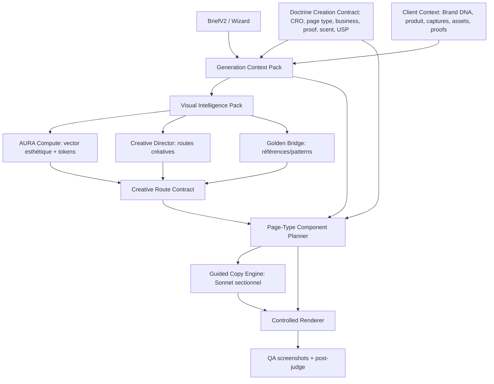

# Codex -> Claude Handoff — GSG / GrowthCRO Alignment Check — 2026-05-11

## Purpose

This file is the handoff from Codex to Claude after Mathis asked whether the
new `~/Developer/growth-cro` repo correctly absorbed the 10-day Codex work on
branch `v26ag` / V27.2 GSG.

Claude must use this as an alignment checklist before touching the GSG again.
Do not treat this as gospel: verify every claim against the code. The point is
to prevent another drift between strategic architecture, docs, checks and real
runtime.

## Critical Context

The active repo is now:

```bash
/Users/mathisfronty/Developer/growth-cro
```

Not the old iCloud-synced path:

```bash
/Users/mathisfronty/Documents/Claude/Projects/Mathis - Stratégie CRO Interne - Growth Society
```

Mathis moved the project to `~/Developer/growth-cro`, connected it to GitHub,
merged the Codex `v26ag` work, and then ran a cleanup / versioning effort with
Claude Code using CCPM, PRDs, epics and issues.

Important naming clarification:

- `V26.AG` can refer to the fresh-history / migration baseline.
- `V27.2-F` / `V27.2-G` refer to the canonical GSG evolution.
- If Claude says "V26.AG", that is not automatically wrong. But it must not
  imply that the GSG architecture reverted to old V26 behavior.

## Brutal Verdict From Codex Read-Only Audit

Claude has mostly understood the strategic architecture, but the repo is not
fully aligned functionally.

The conceptual GSG architecture is present in docs and mostly present in code:

- `skills/gsg` is the unique public GSG skill.
- `moteur_gsg` is the unique public GSG engine.
- `skills/growth-site-generator/scripts` is legacy lab / migration source only.
- Mode 1 is autonomous.
- Mode 2 is the only mode that should require Audit/Reco.
- Doctrine is used upstream as a creation contract, not only as post-run audit.
- AURA / Brand DNA / Design Grammar are intended as structural inputs/tokens.
- Creative Route Contract happens before the planner.
- Copy LLM is bounded to JSON slots.
- Renderer owns HTML/CSS.
- Multi-judge is post-run QA, not a blocking generation gate.

But `main` currently has runtime and validation drift:

1. GSG Mode 1 controlled path fails to import.
2. The canonical check points to a stale docs path.
3. Some checks still expect V27.2-F while code is already V27.2-G.
4. README / docs are partially stale.
5. Issue #13 fixed persona-narrator prompt architecture, but broke the canonical controlled GSG path.

## Canonical GSG Architecture To Preserve



## What Is Actually Present In Code

### Context Pack

File:

```text
moteur_gsg/core/context_pack.py
```

Key evidence:

- `GenerationContextPack`
- `MODE_AUDIT_DEPENDENCY`
- `build_generation_context_pack(...)`
- `audit_dependency_policy`
- Brand summary, business inference, audience, proof inventory, scent contract,
  visual assets, design sources, risk flags.

This is aligned with the Codex architecture.

### Doctrine Creation Contract

File:

```text
moteur_gsg/core/doctrine_planner.py
```

Key evidence:

- `DoctrineConstructivePack`
- `build_doctrine_pack(...)`
- Uses:
  - `scripts/doctrine.py`
  - `playbook/page_type_criteria.json`
  - `data/doctrine/applicability_matrix_v1.json`
  - `data/doctrine/criteria_scope_matrix_v1.json`
- Produces:
  - applicable criteria
  - page-type-specific criteria
  - excluded / NA criteria
  - evidence policy
  - section directives
  - copy directives
  - renderer directives
  - creation contract

This is aligned with the Codex architecture.

### Visual Intelligence Pack

File:

```text
moteur_gsg/core/visual_intelligence.py
```

Key evidence:

- `VisualIntelligencePack`
- `CreativeRouteContract`
- `build_visual_intelligence_pack(...)`
- AURA is explicitly not a standalone creative brain.
- Inputs include context pack, doctrine pack, business category, page type,
  proof visibility, traffic/source context, brand palette/fonts.
- Outputs include:
  - `aura_input_contract`
  - `creative_director_seed`
  - `golden_bridge_query`

This is aligned with the Codex architecture.

### Structured Creative Route Selector

File:

```text
moteur_gsg/core/creative_route_selector.py
```

Key evidence:

- V27.2-F bridge between VisualIntelligencePack, AURA and Golden Bridge.
- No LLM.
- No prompt dumping.
- `build_structured_creative_route_contract(...)`
- Produces `CreativeRouteContract` with:
  - route name
  - risk level
  - golden references
  - technique references
  - route decisions
  - renderer overrides

This is aligned with the Codex architecture.

### Visual System / Premium Layer

File:

```text
moteur_gsg/core/visual_system.py
```

Important: the code is already V27.2-G, even if several docs/checks still say
V27.2-F.

Key evidence:

```py
"version": "gsg-visual-system-v27.2-g"
"premium_layer": "gsg-premium-visual-layer-v27.2-g"
```

This means the next status should probably be V27.2-G, not V27.2-F.

### Mode 1 Controlled Pipeline

File:

```text
moteur_gsg/modes/mode_1_complete.py
```

The actual controlled path is:

```text
build_generation_context_pack
-> build_doctrine_pack
-> build_visual_intelligence_pack
-> build_structured_creative_route_contract
-> build_design_tokens
-> build_page_plan
-> call_copy_llm OR fallback_copy_from_plan
-> render_controlled_page
-> apply_runtime_fixes
-> minimal deterministic gates
-> optional multi-judge
```

This is the right architecture. But it currently fails at import because of
`copy_writer.py`.

## Current P0 Runtime Break

Codex ran this read-only:

```bash
PYTHONDONTWRITEBYTECODE=1 python3 scripts/check_gsg_controlled_renderer.py
```

It failed with:

```text
ImportError: cannot import name '_ensure_api_key' from 'moteur_gsg.core.pipeline_single_pass'
```

Cause:

```text
moteur_gsg/core/copy_writer.py
```

contains:

```py
from .pipeline_single_pass import SONNET_MODEL, _ensure_api_key
```

But after issue #13:

```text
moteur_gsg/core/pipeline_single_pass.py
```

no longer exports `_ensure_api_key`.

`_ensure_api_key` is not used in `copy_writer.py`, so the minimal fix is to
remove it from the import.

Cleaner fix:

- Route `copy_writer.py` through:

```py
from growthcro.lib.anthropic_client import get_anthropic_client
```

- Replace:

```py
api = anthropic.Anthropic()
```

with:

```py
api = get_anthropic_client()
```

This aligns with the cleanup doctrine: single env/config boundary.

## Current P0 Canonical Check Break

Codex ran:

```bash
PYTHONDONTWRITEBYTECODE=1 python3 scripts/check_gsg_canonical.py
```

It failed with:

```text
Missing V27.2 GSG contract file: architecture/GSG_RECONSTRUCTION_SPEC_V27_2_2026-05-06.md
```

Cause:

```text
moteur_gsg/core/canonical_registry.py
```

expects:

```text
architecture/GSG_RECONSTRUCTION_SPEC_V27_2_2026-05-06.md
```

but the real path is:

```text
.claude/docs/architecture/GSG_RECONSTRUCTION_SPEC_V27_2_2026-05-06.md
```

Fix:

- Update `canonical_registry.py` to use `.claude/docs/architecture/...`.
- Or make the check accept both old and new locations, but prefer the new
  `.claude/docs/architecture` path.

## Current P1 Check Drift: V27.2-F vs V27.2-G

File:

```text
scripts/check_gsg_creative_route_selector.py
```

still checks:

```py
"gsg-visual-system-v27.2-f" in html
```

But the actual visual system returns:

```py
"gsg-visual-system-v27.2-g"
```

Fix:

- Update route selector and visual renderer checks to V27.2-G.
- Add an explicit check for:
  - `data-premium-layer=`
  - `gsg-premium-visual-layer-v27.2-g`
  - premium reason visual markers, e.g. `data-premium-visual=`

Recommended new check name:

```text
scripts/check_gsg_premium_visual_layer.py
```

## Current Docs Drift

Docs still saying V27.2-F need a pass.

Files to inspect/update after runtime fixes:

```text
README.md
moteur_gsg/README.md
skills/gsg/SKILL.md
.claude/docs/reference/START_HERE_NEW_SESSION.md
.claude/docs/reference/GROWTHCRO_MANIFEST.md
.claude/docs/architecture/REFONTE_TOTAL_TRACKER_2026-05-05.md
.claude/docs/architecture/GSG_RECONSTRUCTION_SPEC_V27_2_2026-05-06.md
.claude/docs/state/ARCHITECTURE_SNAPSHOT_POST_CLEANUP_2026-05-11.md
```

Important: do not update docs before verifying the runtime. Fix and test first.

## Weglot Listicle Status

The last real validated Weglot listicle is not V27.2-F/G. It is the V27.2-D
true run:

```text
deliverables/weglot-lp_listicle-GSG-V27-2C-TRUE.html
data/_pipeline_runs/weglot_lp_listicle_v272c_true/canonical_run_summary.json
data/_pipeline_runs/weglot_lp_listicle_v272c_true/multi_judge.json
```

Known score:

```text
final_score_pct: 70.9
doctrine: 67.5
humanlike: 78.8
killers: 0
```

V27.2-F is a route selector architecture win.
V27.2-G appears in code as premium visual layer.
But there is not yet a final validated LP output for V27.2-F/G after issue #13.

## Parity / Weglot Data Correction

Claude previously mentioned an empty Weglot baseline from V26.AG fresh-history.
That was true earlier, but not true now.

Current evidence:

```text
data/captures/weglot/ exists
_archive/parity_baselines/weglot/2026-05-11T07-49-17Z/MANIFEST.txt has 108 files
```

Do not keep using the old "baseline vide" statement unless explicitly referring
to the initial 2026-05-09 baseline.

## Immediate DoD Before Any New GSG Feature

Claude should first fix the alignment breakages, then run:

```bash
PYTHONDONTWRITEBYTECODE=1 python3 scripts/check_gsg_canonical.py
PYTHONDONTWRITEBYTECODE=1 python3 scripts/check_gsg_controlled_renderer.py
PYTHONDONTWRITEBYTECODE=1 python3 scripts/check_gsg_creative_route_selector.py
PYTHONDONTWRITEBYTECODE=1 python3 scripts/check_gsg_visual_renderer.py
PYTHONDONTWRITEBYTECODE=1 python3 scripts/check_gsg_intake_wizard.py
PYTHONDONTWRITEBYTECODE=1 python3 scripts/check_gsg_component_planner.py
python3 SCHEMA/validate_all.py
python3 scripts/audit_capabilities.py
```

Expected target:

- all GSG checks PASS
- canonical check PASS
- no import error in `mode_1_complete`
- V27.2-G markers reflected consistently
- no new HIGH orphan
- no schema regression

## Recommended Fix Order

1. Fix `copy_writer.py` import/API client path.
2. Run controlled renderer check.
3. Fix `canonical_registry.py` path to `.claude/docs/architecture`.
4. Run canonical check.
5. Update checks from V27.2-F to V27.2-G where code already is G.
6. Add a premium visual layer smoke check.
7. Only then update docs/manifest/skill/readmes.
8. Then run a no-LLM fallback GSG smoke.
9. Then run Weglot with Sonnet.
10. Then run one non-SaaS or non-listicle real test.

## Claude Prompt To Use

Copy/paste this into Claude Code:

```text
Lis d'abord ce fichier en entier :
.claude/docs/state/CODEX_TO_CLAUDE_GSG_ALIGNMENT_HANDOFF_2026-05-11.md

Tu es en mode ALIGNMENT + VERIFY, pas feature sprint.

Objectif :
1. Vérifier toutes les affirmations Codex contre le code réel.
2. Confirmer ou corriger le diagnostic.
3. Ne pas toucher au GSG créatif tant que les checks canoniques ne repassent pas.
4. Réparer uniquement les P0/P1 d'alignement si tu confirmes le diagnostic :
   - import cassé `copy_writer.py`
   - chemin stale dans `canonical_registry.py`
   - checks V27.2-F alors que code V27.2-G
   - docs stale après validation runtime uniquement

Contraintes :
- Ne fais pas de nouvelle feature GSG.
- Ne réécris pas l'architecture.
- Ne reviens pas au mega-prompt.
- Garde `skills/gsg` + `moteur_gsg` comme canonique.
- `skills/growth-site-generator` reste legacy lab/adapters seulement.
- Mode 2 seul dépend d'Audit/Reco.
- Doctrine doit rester upstream dans le GSG via `DoctrineCreationContract`.
- AURA doit rester alimenté par contexte + doctrine + business + page type, pas autonome.

Commandes de vérification initiales :
PYTHONDONTWRITEBYTECODE=1 python3 scripts/check_gsg_canonical.py
PYTHONDONTWRITEBYTECODE=1 python3 scripts/check_gsg_controlled_renderer.py
PYTHONDONTWRITEBYTECODE=1 python3 scripts/check_gsg_creative_route_selector.py
PYTHONDONTWRITEBYTECODE=1 python3 scripts/check_gsg_visual_renderer.py
python3 SCHEMA/validate_all.py
python3 scripts/audit_capabilities.py

Livrable attendu :
- Verdict honnête : Codex avait raison / tort / partiellement raison.
- Liste des fichiers touchés si correction.
- Résultats exacts des checks.
- État final : GSG V27.2-F ou V27.2-G, mais cohérent code + docs + checks.
- Ne lance pas de vraie génération Sonnet avant que les smoke tests sans LLM soient verts.
```

## Final Reminder

Do not let this become a new creative sprint. This is a synchronization repair.

The current priority is not "make GSG more stratospheric". The priority is:

```text
make the canonical GSG import, validate, and tell the truth about its version.
```

Once this is green, then the next legitimate product sprint is:

```text
V27.2-G validation + first real non-SaaS/non-listicle generation.
```

