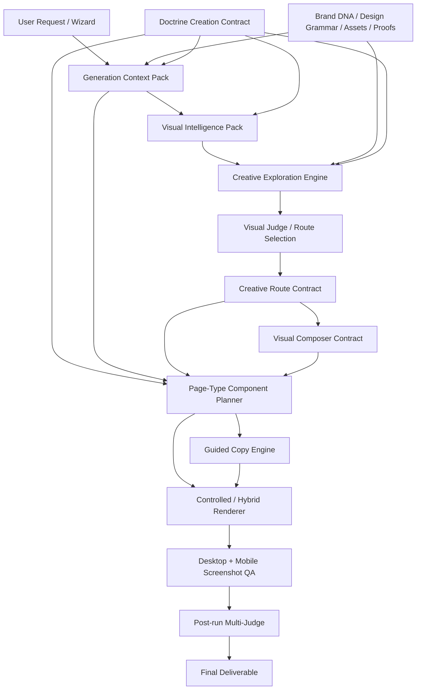

# Codex -> Claude Addendum — Why Direct LLM Design Beats Current GSG, And How To Fix It — 2026-05-16

## Purpose

This is an addendum to the previous Codex handoff:

```text
.claude/docs/state/CODEX_TO_CLAUDE_GSG_ALIGNMENT_HANDOFF_2026-05-11.md
```

That previous file focused on alignment, broken checks, runtime drift and the
canonical GSG architecture.

This addendum focuses on the deeper product/design question Mathis raised:

> Why can a raw frontier chat model generate a visually impressive landing page
> in one shot, while the coded GSG outputs still feel flat, beginner-level and
> AI-like after months of architecture work?

Claude should read this before continuing any GSG product/refonte work.

## Brutal Answer

The current GSG is not weak because the base models are incapable.

It is weak because the system took creative freedom away from the model before
building a sufficiently rich deterministic design engine to replace that freedom.

Direct frontier-model prompting can produce visually impressive pages because
it has permission to make broad aesthetic decisions:

- visual style
- composition
- spatial rhythm
- hero mechanics
- motion
- effects
- textures
- decorative systems
- dashboard-like objects
- typography scale
- visual metaphor
- page pacing

The current GSG mostly does the opposite:

- it bounds the LLM to copy JSON slots;
- it prevents the LLM from freely deciding layout;
- it forces doctrine, proof discipline, CTA rules and artefact constraints;
- it avoids mega-prompts;
- it routes output through a controlled renderer;
- it was made defensive by prior anti-AI-slop failures;
- it has more CRO safety than visual ambition.

That architecture is not wrong. It is incomplete.

The missing layer is a real creative/design exploration and visual composition
engine.

## The Six Key Points

### 1. Direct LLM prompting has full creative latitude

When a frontier model is asked to show its maximum landing page capability, it
can choose the whole visual language freely. It can make a cinematic interface,
use dramatic layout, add motion, create a rich hero object, invent a dashboard
surface, layer gradients, grain, glass, depth and animation.

This gives immediate visual impact.

Current GSG does not let the model do that freely.

### 2. GSG is currently optimized for control, not wonder

The GSG became a safety-first machine:

- no hallucinated proof;
- no uncontrolled full-page HTML by the LLM;
- no arbitrary layout;
- no giant context dumps;
- no post-polish chaos;
- deterministic gates;
- strict doctrine;
- structured renderer.

That makes the system safer and more reproducible, but it also makes it visually
conservative unless the renderer itself has strong taste.

### 3. The controlled renderer is not yet a premium art direction system

The renderer can structure pages and avoid chaos, but it cannot yet consistently
produce exceptional design across:

- ecommerce;
- consumer brands;
- luxury;
- B2B;
- marketplaces;
- apps;
- local services;
- media/editorial;
- education;
- health/wellness;
- finance;
- creator products;
- enterprise;
- any future page type.

It lacks a deep library of visual systems, section mechanics, motion patterns,
texture rules, image strategies and brand-specific composition models.

### 4. Anti-AI-slop rules became too defensive

The old reaction to bad outputs was to ban many visible techniques. But some of
those techniques are exactly what premium pages use when applied with taste:

- gradients;
- glass;
- shadows;
- blur;
- 3D-ish panels;
- grain;
- animated depth;
- large typographic scale;
- editorial interruption;
- visual metaphor;
- interface-like compositions.

The system should ban lazy defaults, not the entire toolbox.

Bad:

```text
generic gradient blob + fake icons + random cards + empty SaaS claims
```

Good:

```text
brand-specific visual system + purposeful depth + real assets + strong rhythm
```

### 5. The GSG should not be a narrow page generator

The GSG is not supposed to be a generator for one business category, one client
type, one SaaS tone, one page type, one listicle format, or one audit handoff.

It must become a universal GrowthCRO creation system capable of producing
exceptional pages for any context:

- new landing page from scratch;
- page rewrite;
- offer page;
- product page;
- pricing page;
- quiz / diagnostic;
- leadgen;
- editorial;
- advertorial;
- comparison;
- home;
- collection;
- category;
- VSL / webinar;
- high-end brand page;
- local service;
- ecommerce product;
- app acquisition;
- enterprise solution;
- creator / course / community;
- any future GrowthCRO page format.

This means all intermediate layers must support business diversity and page-type
diversity. No hidden assumption that the page is tech/SaaS/editorial.

### 6. The goal is not "LLM freedom vs system control"; it is both

The best GSG should combine:

- frontier-model creativity;
- GrowthCRO doctrine;
- brand context;
- real assets;
- proof discipline;
- deterministic structure;
- visual QA;
- reproducible production.

The target is not to make the system less rigorous.

The target is:

```text
frontier-model creative exploration
+ GrowthCRO strategic intelligence
+ deterministic selection and rendering
+ visual QA
```

## Product Conclusion

The current GSG has a strong strategic skeleton but an underpowered visual soul.

The system has:

- context;
- doctrine;
- page-type planning;
- Brand DNA;
- Design Grammar;
- AURA direction;
- Golden references;
- bounded copy;
- controlled rendering;
- post-run judging.

But it does not yet have a strong enough creative exploration layer or visual
composer.

That is why a raw model can sometimes look more impressive: the raw model is
allowed to imagine the page, while the GSG is often only allowed to fill a safe
template.

## Proposed New Layer: Creative Exploration Engine

Add a new layer before the deterministic planner/renderer:

```text
Creative Exploration Engine
```

Its job is not to output final production HTML.

Its job is to explore strong creative directions and distill them into a
structured contract that the GSG can safely use.

### Inputs

- user request / wizard;
- page type;
- business category;
- offer / product / service;
- target audience;
- funnel stage;
- traffic context;
- objective;
- Brand DNA;
- Design Grammar;
- AURA tokens / vector;
- doctrine creation contract;
- proof inventory;
- available assets;
- inspiration URLs or golden references;
- constraints / must-not-do rules.

### Outputs

The engine should produce multiple creative directions, for example 3 to 5:

- route name;
- aesthetic thesis;
- spatial layout thesis;
- hero mechanism;
- section rhythm;
- visual metaphor;
- motion language;
- texture/material language;
- image/asset strategy;
- typography strategy;
- color strategy;
- proof visualization strategy;
- page-type-specific modules;
- risks;
- why this route fits the business/page/audience.

Then the system selects or ranks one route and distills it into:

```text
CreativeRouteContract
VisualComposerContract
RendererBrief
```

## Target Workflow

```text
1. User request / wizard
   -> understand what must be generated, for whom, why, and under what constraints.

2. Generation Context Pack
   -> collect client/product/business/audience/assets/proofs/context.

3. Doctrine Creation Contract
   -> translate CRO doctrine into upstream creation rules.

4. Visual Intelligence Pack
   -> translate context + doctrine + brand + page type into visual needs.

5. Creative Exploration Engine
   -> ask a frontier model for several bold creative directions.
   -> this may be Claude, GPT, or another strong creative model.
   -> output is structured concepts, not production HTML.

6. Visual Judge / Route Selection
   -> select the strongest route based on relevance, originality, brand fit,
      CRO fit, feasibility and visual potential.

7. Creative Route Contract
   -> compress the selected route into deterministic, renderer-facing decisions.

8. Visual Composer
   -> convert route into concrete sections, modules, layouts, assets, motion,
      textures, visual mechanics and responsive behavior.

9. Guided Copy Engine
   -> use Sonnet/frontier model for excellent section-level copy, heavily guided
      by context, doctrine and route.

10. Controlled / Hybrid Renderer
   -> generate production-quality HTML/CSS/JS with strong visual modules.
   -> not a generic safe template.

11. Screenshot QA
   -> desktop + mobile screenshots.
   -> check overflow, hierarchy, text fit, asset rendering, blank areas,
      coherence, and visual ambition.

12. Post-run Multi-Judge
   -> doctrine/humanlike/implementation as QA, not as generation gate.

13. Optional improvement loop
   -> only after visual screenshot critique, not blind prompt polishing.
```

## Architecture Diagram



## Model Strategy

Do not assume one model should do everything.

Recommended split:

### Frontier creative model

Use the strongest available model for:

- creative directions;
- art direction exploration;
- interaction ideas;
- hero concepts;
- page rhythm;
- visual metaphor;
- premium design alternatives.

This can be GPT, Claude, or another model depending on observed output quality.

### Claude / Codex engineering agent

Use coding agents for:

- integration;
- refactor;
- clean architecture;
- checks;
- file discipline;
- test harnesses;
- QA automation;
- renderer implementation.

### Image generation / asset model

Use image generation when the page needs:

- custom background images;
- product-style scenes;
- textures;
- editorial illustrations;
- abstract brand worlds;
- transparent cutouts;
- campaign visuals.

Do not force everything to be SVG/CSS if a generated bitmap would carry the
subject better.

### Screenshot judge

Mandatory.

HTML source is not enough to judge design. The system needs rendered screenshots
and visual inspection.

## Skills / Tools Direction

Claude Skills, Codex Skills, subagents and hooks are useful, but they should be
used to enforce workflows, not to hide vague creative thinking.

Recommended skills / agents:

- `gsg-creative-explorer`
- `gsg-visual-judge`
- `gsg-visual-composer`
- `gsg-brand-fit-judge`
- `gsg-page-type-planner`
- `gsg-renderer-qa`

Each should have a narrow role and explicit inputs/outputs.

Do not create a giant "stratospheric GSG" prompt skill. That recreates the
mega-prompt anti-pattern.

## What To Change In The GSG Roadmap

After runtime alignment is fixed, the next GSG roadmap should not jump straight
to more renderer tweaks.

Recommended order:

1. Fix runtime/check/doc alignment first.
2. Add Creative Exploration Engine as a non-production exploration layer.
3. Create a structured output schema for creative routes.
4. Add VisualComposerContract.
5. Expand visual systems across business categories and page types.
6. Build screenshot QA and visual judging.
7. Run diverse test cases, not just one category or one page type.
8. Only then optimize production rendering.

## Non-Negotiables

- GSG must be universal across business categories and page types.
- Do not optimize for one client, one vertical, one page format or one aesthetic.
- Do not reintroduce a giant unstructured prompt.
- Do not let the LLM invent proof.
- Do not make the renderer so safe that it kills taste.
- Do not confuse "controlled" with "boring".
- Do not judge design from HTML text alone.
- Do not run post-run judges as generation blockers.
- Do not use Audit/Reco as a required dependency except Mode 2.

## Final Product Thesis

The future GSG should not be less creative than a raw frontier chat model.

It should be:

```text
raw frontier-model creativity
+ GrowthCRO doctrine
+ real client/business context
+ Brand DNA and Design Grammar
+ AURA visual intelligence
+ selected creative routes
+ premium visual composition
+ controlled production rendering
+ screenshot QA
+ post-run judging
```

The current system has many of the intelligence layers.

The missing piece is:

```text
creative exploration + visual composition strong enough to match or beat raw model output.
```

Claude should treat this as a product architecture gap, not as a prompt wording
problem.

