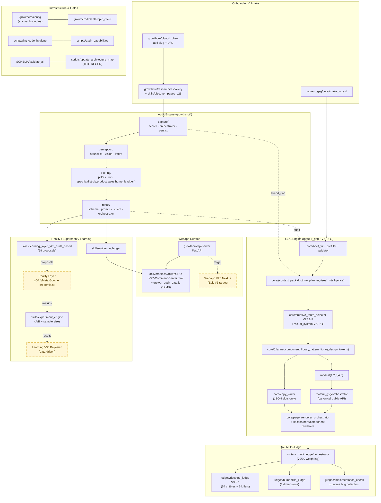
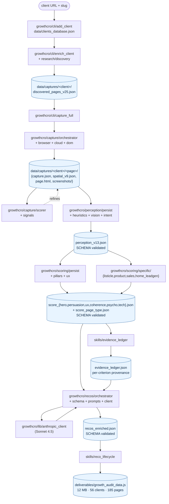
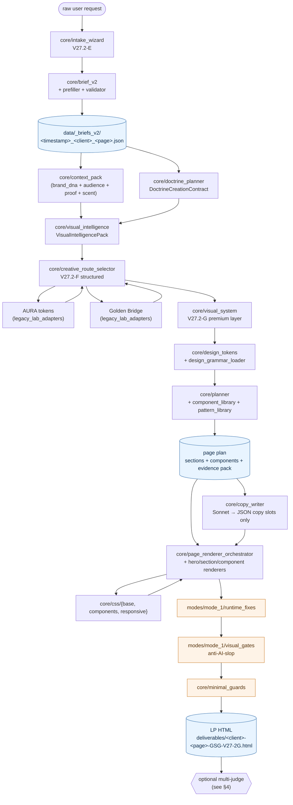
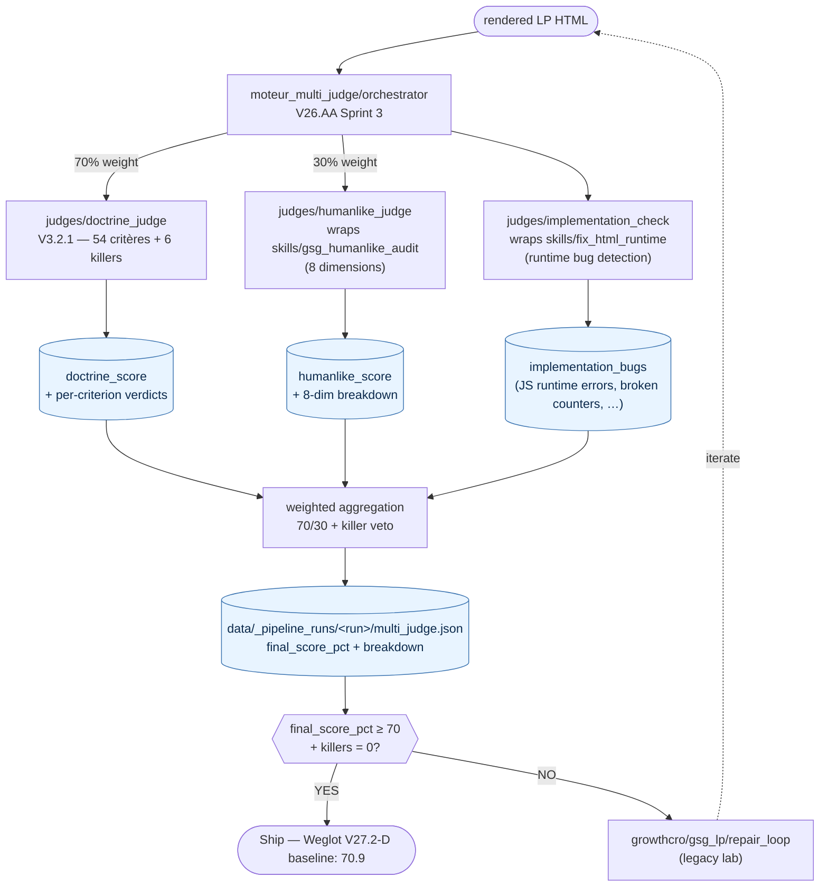
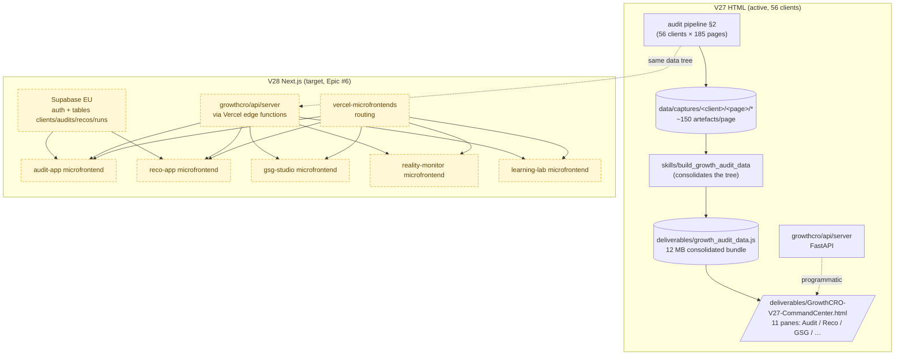
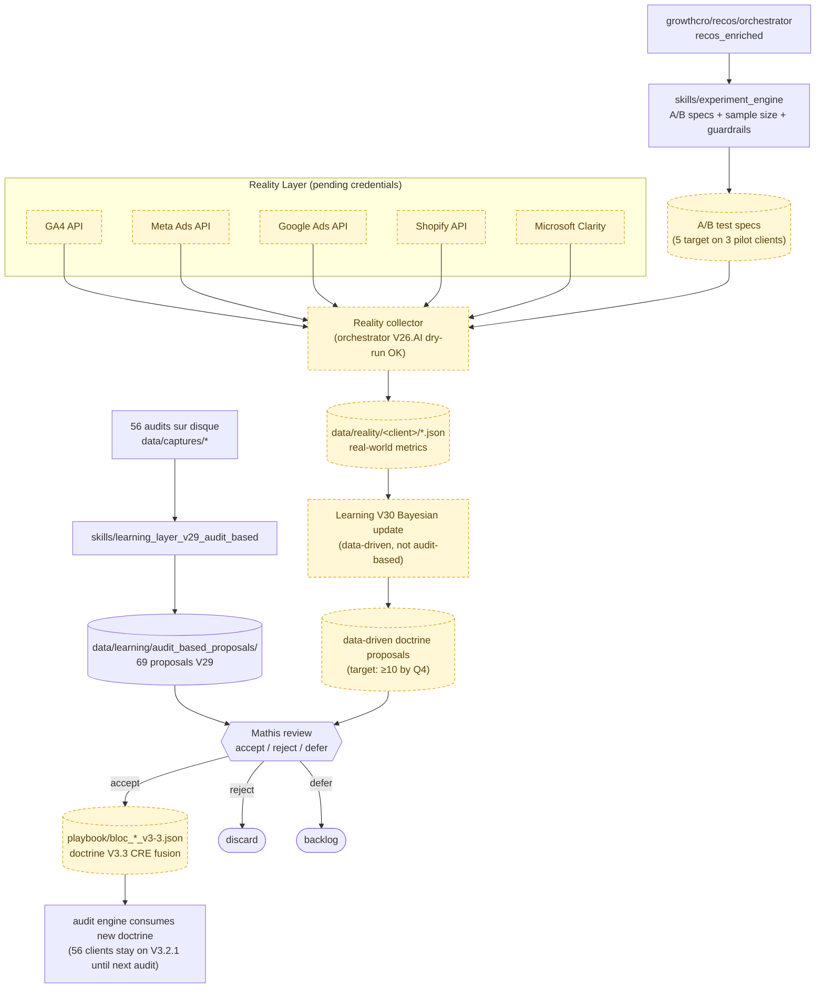

# Webapp Architecture Map — V1 (2026-05-11)

**Companion to `.claude/docs/state/WEBAPP_ARCHITECTURE_MAP.yaml`.**

The YAML is the machine-readable source of truth (auto-refreshed by
`scripts/update_architecture_map.py`). This Markdown file gives a human reader
six Mermaid views that cover the whole program in ten minutes. The two are
intentionally kept in sync via the same regen script (see footer).

Conventions:
- Each Mermaid block is followed by 1-2 paragraphs explaining what the
  diagram means and where it lives in the YAML.
- Module names match the YAML keys (`growthcro/capture/scorer`,
  `moteur_gsg/core/visual_system`, …).
- Yellow-tagged nodes are upcoming work (V28 Next.js, Reality Loop with real
  credentials, V3.3 doctrine fusion). Everything else is on disk today.

---

## 1. Global view — the whole program in one diagram



**What this shows.** The five horizontal bands map 1:1 to the eight YAML
`pipelines:` block + the infrastructure bag. Solid arrows = wired in code
today; dashed arrows = data hand-offs through disk artefacts; dashed nodes
(`Reality Layer`, `V28 Next.js`, `Learning V30`) are next-epic work but
already have placeholder entries in the YAML. The infra band at the bottom
holds the four non-pipeline gates that every conversation must call
(`config`, `anthropic_client`, `lint`, `audit_capabilities`, `SCHEMA`,
this regen script).

**What it omits on purpose.** Internal module-to-module imports are in the
YAML `depends_on` / `imported_by` fields; surfacing them here would make the
diagram unreadable. Use the YAML for graph queries.

---

## 2. Audit pipeline — capture to reco



**What this shows.** The canonical audit pipeline as it lives on `main`
post-cleanup. Each blue node is a JSON / JS artefact persisted on disk; every
green node is a Python module from the `growthcro/` package. The orchestrator
respects Rule 4 of the code doctrine (one concern per file) — capture is split
across `browser`/`cloud`/`dom`/`orchestrator`/`scorer`/`signals`, perception
fans out into `heuristics`/`vision`/`intent`/`persist`, and scoring splits
by pillar (`pillars` + `ux`) plus page-type-specific detectors.

**Why it matters.** Every audit run produces exactly this artefact tree, and
every downstream consumer (V27 HTML dashboard, GSG context pack, V29 learning
loop) reads from these JSONs — no shadow store. SCHEMA validation gates run
at `perception_v13`, `score_pillar`, `score_page_type`, `recos_enriched`.

---

## 3. GSG pipeline — V27.2-G controlled path



**What this shows.** The full canonical Mode 1 COMPLETE path on V27.2-G. The
LLM only writes copy as JSON slots (Sonnet text-only via `core/copy_writer`);
all visuals, structure, tokens, and CSS are deterministic. The premium visual
layer markers (`gsg-visual-system-v27.2-g`, `gsg-premium-visual-layer-v27.2-g`)
are emitted by `visual_system.py` and asserted by
`scripts/check_gsg_creative_route_selector.py` + `check_gsg_visual_renderer.py`
(see Codex handoff 2026-05-11 P1 fix).

**Mode dispatch.** Modes 2-5 share most of this pipeline; the differences live
in `mode_{2,3,4,5}*.py`:
- Mode 2 REPLACE — consumes audit V26 output for comparative refonte (the only mode that *requires* an audit).
- Mode 3 EXTEND — reuses existing `brand_dna` to add a new concept on a known site.
- Mode 4 ELEVATE — challenger DA seeded by inspiration URLs.
- Mode 5 GENESIS — brief-only, no live site.

The public entrypoint for any mode is `moteur_gsg/orchestrator.py`.

---

## 4. Multi-Judge — post-render QA layer



**What this shows.** The three-judge fan-out + 70/30 doctrine/humanlike
weighting + killer-rule veto. The Doctrine Judge consumes the SAME
`playbook/bloc_{1..6}_v3.json` files as the audit scorer — that's the
"racine partagée" insight from V26.AA. The Humanlike Judge and
Implementation Check are wrappers around legacy `skills/growth-site-generator`
scripts kept in production because they work; refactoring them into
`moteur_multi_judge/judges/*.py` is out of scope until they evolve.

**When it runs.** Multi-judge is *post-render QA*, not a blocking generation
gate. The GSG can ship without it (lite mode); enabling it adds ~5 minutes
per LP. The legacy `growthcro/gsg_lp/repair_loop.py` iterates the multi-judge
output back into the renderer; in the canonical V27.2-G path the loop is
replaced by `moteur_gsg/core/minimal_guards.py` which is deterministic and
non-iterative.

---

## 5. Webapp — V27 HTML today, V28 Next.js target



**What this shows.** V27 (today) is a single 12 MB `growth_audit_data.js`
bundle consumed by a static HTML Command Center — works for 56 clients but
won't scale to 100+. V28 (Epic #6 target) is a Next.js 14 monorepo with
five microfrontends, Supabase auth + tables, and the same FastAPI server
exposed as Vercel edge functions. The audit pipeline data tree is the
shared bus — both V27 HTML and V28 Next.js read from it without changes.

**Migration strategy.** V27 stays live during the entire V28 build (Epic #6
strategy AD-6). The migration is microfrontend-by-microfrontend, never a
big-bang flip. The legacy `build_growth_audit_data.py` god file is in
`KNOWN_DEBT` (803 LOC) and will be split as part of Epic #5.

---

## 6. Reality / Experiment / Learning loop



**What this shows.** The full closed loop from audit → action → measurement
→ learning → doctrine update → next audit. V29 (audit-based learning) is
ACTIVE today and has generated 69 proposals; V30 (data-driven Bayesian) is
PENDING because the Reality Layer needs credentials on 3 pilot clients
(Epic #8, FR-8). The 69 V29 proposals queue feeds Epic #3 (doctrine V3.3
CRE fusion) — that's the "K mutualisé" remark in the epic doc.

**Status today.** Out of the 7-stage loop, stages 1-3 (audit fleet, V29
extraction, 69 proposals) are wired and producing artefacts. Stages 4-7
(Reality collect, Experiment Engine A/B, V30 Bayesian, doctrine V3.4)
require Mathis to collect credentials on 3 pilot clients + 5 measured A/Bs;
the orchestrator skeleton runs in dry-run mode without raising.

---

## Cross-references

- Machine-readable YAML: `.claude/docs/state/WEBAPP_ARCHITECTURE_MAP.yaml`
- Auto-regen script: `scripts/update_architecture_map.py`
- Code doctrine: `.claude/docs/doctrine/CODE_DOCTRINE.md`
- Architecture snapshot post-cleanup: `.claude/docs/state/ARCHITECTURE_SNAPSHOT_POST_CLEANUP_2026-05-11.md`
- Codex GSG handoff (V27.2-G alignment): `.claude/docs/state/CODEX_TO_CLAUDE_GSG_ALIGNMENT_HANDOFF_2026-05-11.md`
- Epic technique: `.claude/epics/webapp-stratosphere/epic.md`
- PRD master: `.claude/prds/webapp-stratosphere.md` (FR-1 / US-1)

---

**Last regen**: see `meta.generated_at` in the YAML.

**To regenerate** (after merging an epic that adds / moves / deletes modules):

```bash
python3 scripts/update_architecture_map.py
```

The script is idempotent and preserves human-curated `purpose` / `inputs` /
`outputs` / `doctrine_refs` / `status` / `lifecycle_phase` fields. Only
`path`, `depends_on`, `imported_by`, and the `meta.generated_at` /
`meta.source_commit` are refreshed on every run.
